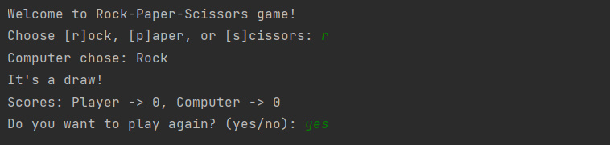
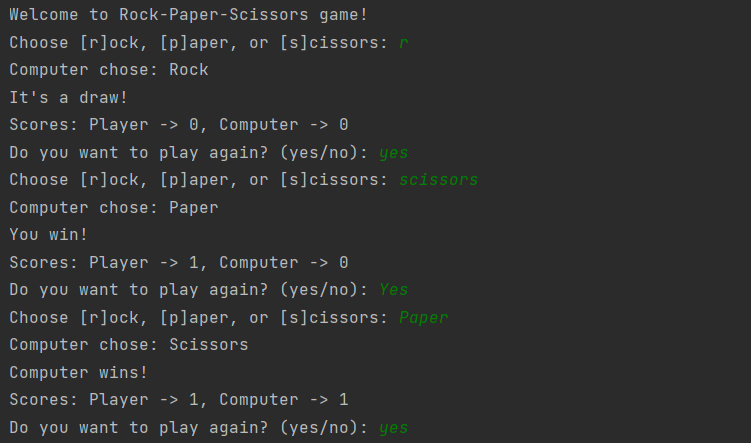
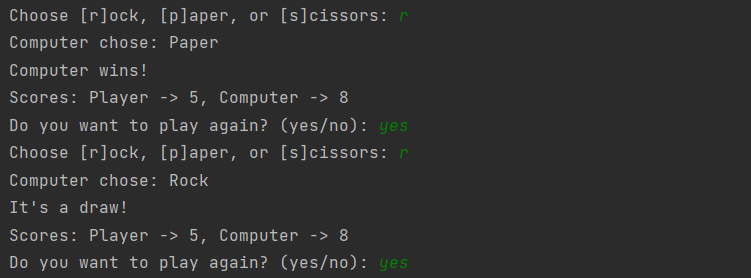
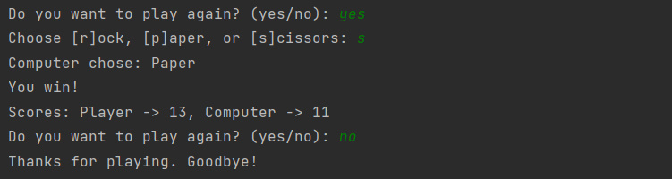
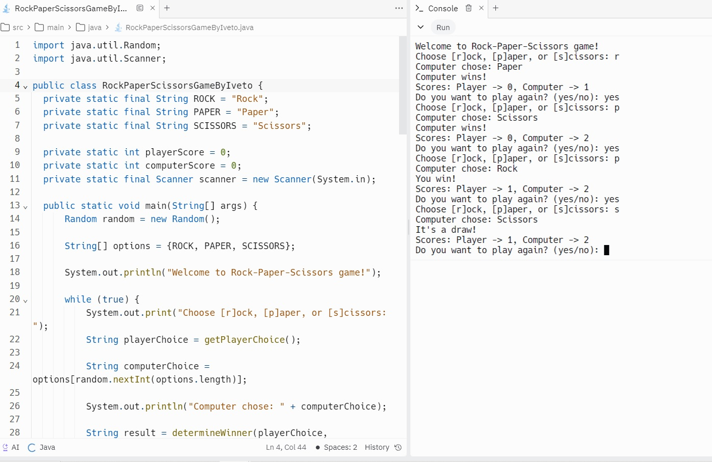

  <h1>RockPaperScissorsGameByIveto</h1>
  
  
The Rock-Paper-Scissors Game is a simple interactive two-player experience, where one player is a human making choices between 'rock', 'paper' or 'scissors' and the other player is the computer. The goal of this project is to provide a fun and interactive implementation of the classic game.

## Solution
The game is implemented in Java and provides a console-based user interface. It includes features such as player input validation, a scoring system, and the option to restart the game after each round. The code is structured to ensure clarity and modularity.

## Technologies Used
- Java

## Source Code
Find the source code for the project on GitHub: [RockPaperScissors.java](./src)

## Screenshots

## Live Demo
Experience the game in action! You can play the game directly in your Web browser here: [Live Demo](https://replit.com/@stepbystepp333/RockPaperScissorsGameByIveto?v=1)

## Installation Instructions
1. Clone the repository to your local machine.
bash:
git clone <https://github.com/IvetoIvanova/RockPaperScissorsGameByIveto>
2. Navigate to the project directory.
3. Compile the Java code.

## Usage Guide
1. Run the compiled Java program.
2. Follow the on-screen instructions to play the game.
3. Enter your choice by typing [r]ock, [p]aper, or [s]cissors.
4. After each game, you can choose to play again or exit.

## License
This project is licensed under the MIT License - see the [LICENSE](LICENSE) file for details.
